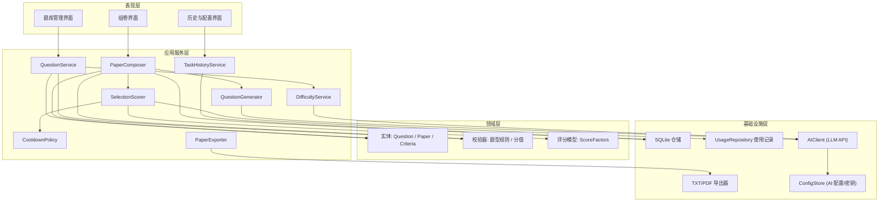
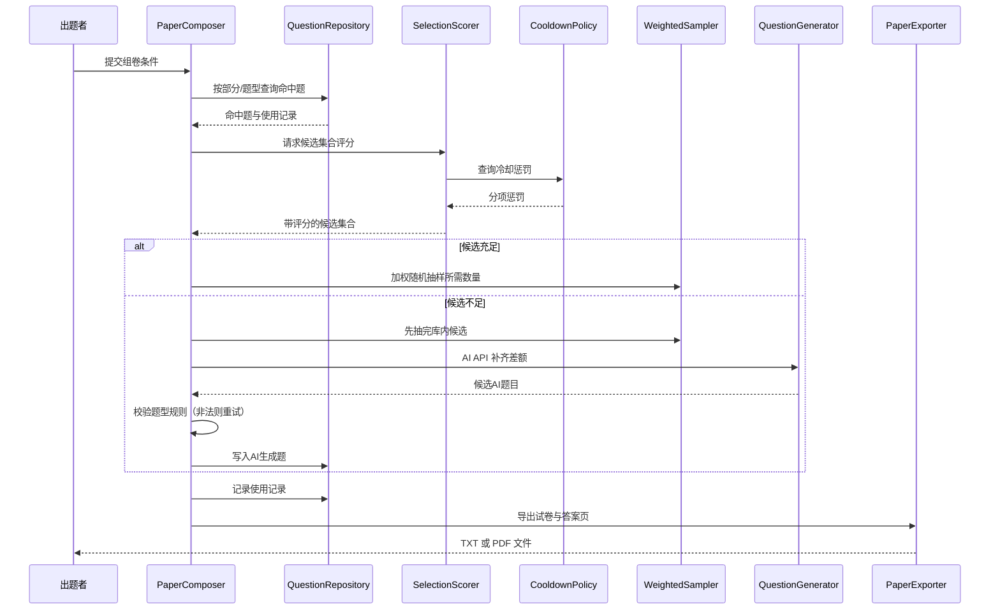
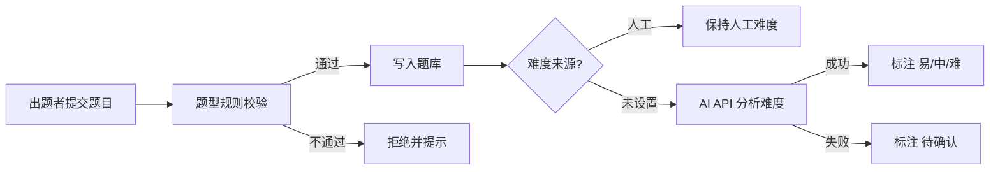
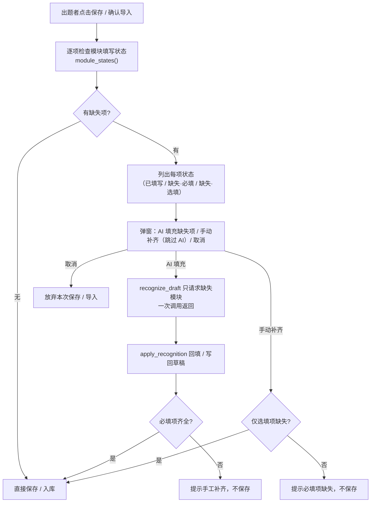

# 自动出题与组卷工具 技术设计

Feature Name: question-paper-generator
Updated: 2026-10-03

## Description

本设计描述一个**桌面端**的自动出题与组卷工具。系统以本地题库为核心数据源：出题者在应用内**手工录入或批量粘贴**题目，题型分为**选择题（单选、多选）**与**解答题**两类；AI 通过 **API 调用**在入库时自动分析难度（易/中/难）。组卷时，出题者分别配置**选择题部分与解答题部分**（两部分均可选，可只选其一或同时选择）的科目、难度与数量。选题引擎先对候选题执行**算法评分决策**（综合难度匹配度、知识点覆盖、使用频次惩罚、最近使用时间惩罚与人工质量标记），再以评分为权重执行**加权随机抽样**，从而兼顾题目质量、覆盖度与新鲜度，并抑制近期重复题目。候选题不足的部分由 **AI API 依据知识点补题**。最终导出**分「选择题 / 解答题」两部分、含每题分值与总分、卷末附答案页的 TXT 或 PDF 试卷**。

设计遵循四条主线：
1. **题库优先、AI 兜底**：题库是首选来源，AI 仅在数量不足时介入。
2. **评分决策、加权随机**：先评分再按权重随机抽样，既不机械排序也不纯随机。
3. **近期重复抑制**：以使用记录与冷却窗口对最近用过的题目降权。
4. **本地桌面运行**：题库、使用记录、组卷历史与配置均保存在本机，无需服务器与账号体系。

## 技术选型（建议）

| 层面 | 选型 | 理由 |
|------|------|------|
| 语言/运行时 | Python 3.11+ | AI SDK 与文档生成生态成熟，单一语言覆盖全栈 |
| 桌面 GUI | PySide6 (Qt) | 跨平台、控件完善、打包成熟 |
| 本地存储 | SQLite | 零配置、单文件、事务可靠 |
| TXT 导出 | 标准库文本排版 | 无需额外依赖，便于二次处理 |
| PDF 导出 | reportlab | 直接生成 PDF，避免外部 Office 依赖 |
| AI 调用 | OpenAI 兼容 HTTP API | 用户可配置 base_url / model / key，兼容主流模型 |

> 备选：Electron + React（界面更灵活，但需同时维护 JS 与导出链路）。本设计以 Python 栈为例，架构分层与组件职责与技术栈无关。

## Architecture

系统采用分层架构，上层依赖下层，领域层不依赖具体基础设施。



关键原则：
- `PaperComposer` 是唯一编排组卷流程的组件，评分、随机抽样与 AI 补题对界面透明。
- `SelectionScorer` 与 `CooldownPolicy` 相互独立，评分因子权重与冷却窗口均可配置。
- `AIClient` 为唯一的外部依赖出口，便于替换、超时控制与离线降级。
- 领域实体与校验器不引用数据库或网络，可独立测试。

## Components and Interfaces

### 1. QuestionService（题目服务）

负责题目增删改查、批量粘贴解析与题型校验编排。

```text
create_question(draft) -> Question            # 校验后落库，触发难度分析
update_question(id, patch) -> Question        # 保留唯一标识与使用记录
delete_question(id) -> void
set_quality_flag(id, flag) -> void            # normal | quality | low
batch_parse(raw_text) -> CandidateDraft[]     # 拆分粘贴文本为候选题目
batch_commit(drafts) -> Question[]            # 批量写入，逐题校验
search(filter) -> Question[]                  # 按科目/知识点/难度/题型检索
count_available(criteria) -> int              # 命中题数量统计
```

### 2. BatchImporter（批量粘贴解析器）

按分隔规则将多段文本拆为候选题，识别题干、选项、答案与解答题参考答案；无法解析的条目标记为"待修正"。基础拆分不依赖 AI。

### 3. DifficultyService（难度分析服务）

```text
analyze(question) -> Difficulty | PENDING     # 通过 AI API 输出 易/中/难
batch_reanalyze(ids) -> TaskHandle            # 存量题重分析（可选）
```

规则：
- 题目保存成功即触发 `analyze`。
- 返回结果非法或 API 调用失败时置为 `PENDING`（待确认），不阻塞入库。
- 若难度来源为"人工"，`analyze` 不覆盖。

### 4. SelectionScorer（选题评分器，核心）

对候选题集合计算选题评分，供加权随机抽样使用。

```text
score(candidates, context) -> ScoredQuestion[]
# 评分 = w1*difficulty_match + w2*knowledge_coverage + w3*quality
#        - w4*use_count_penalty - w5*recency_penalty
```

因子说明：

| 因子 | 方向 | 说明 |
|------|------|------|
| 难度匹配度 difficulty_match | 正向 | 题目难度与目标难度的接近程度 |
| 知识点覆盖 knowledge_coverage | 正向 | 题目知识点尚未被已选题覆盖时加分 |
| 人工质量质量 quality | 正向 | 优质题加分，低质题减分 |
| 使用频次惩罚 use_count_penalty | 负向 | 历史被选次数越多惩罚越大 |
| 最近使用惩罚 recency_penalty | 负向 | 距上次使用越近惩罚越大（冷却窗口内额外加重） |

权重 `w1..w5` 由配置提供，可调。知识点覆盖为动态因子：随已选集合增长而重算。

### 5. CooldownPolicy（冷却窗口策略）

```text
penalty(last_used_at, use_count, now) -> number
in_cooldown(last_used_at, now) -> bool
relax_level() -> number          # 冷却窗口内题量不足时逐步降低惩罚
```

- 冷却窗口默认按时间长度（如 30 天）或按最近 N 次组卷任务定义，二者可选。
- 当某题型在冷却窗口内的可用题量不足以满足数量要求时，逐级放宽惩罚以补足数量。

### 6. WeightedSampler（加权随机抽样器）

```text
sample(scored, k) -> Question[]   # 不放回，权重 = f(score)
```

- 权重取 `max(score, epsilon)`，避免非正权重。
- 每次抽中即从候选集合移除，实现同卷去重。
- 使用可注入的随机数发生器，便于测试。

### 7. PaperComposer（组卷引擎，核心编排）

```text
generate(criteria) -> PaperResult
# 对每个启用的题型:
# 1. 筛选命中题 -> 候选集合
# 2. SelectionScorer 计算评分（含 CooldownPolicy 惩罚）
# 3. 候选充足: WeightedSampler 抽够数量
#   候选不足: 库内全选 + QuestionGenerator 补齐差额
# 4. 校验题型规则，丢弃非法 AI 题目并重试
# 汇总两部分 -> 计算分值与总分 -> 生成答案页数据
```

### 8. QuestionGenerator（AI 补题服务）

```text
generate_questions(subject, knowledge_points, type, difficulty, count) -> Question[]
```

- 通过 AI API 输出符合题型规则的题目，否则丢弃重试（重试次数上限可配置）。
- 生成题目以 `source = AI` 写入题库，供后续复用；不写入使用记录的历史选次（首次使用在入卷时记录）。

### 9. ScoreCalculator（分值计算器）

```text
set_type_score(section, per_question_score) -> void
set_question_score(question_id, score) -> void
section_subtotal(section) -> number      # 数量 × 单题分值
total_score(paper) -> number             # Σ 分区小计
validate_scores(paper) -> ValidationResult  # 存在未设分值时阻止导出
```

### 10. PaperExporter（导出服务）

```text
export(paper, format: TXT | PDF, target_dir, options) -> file_path
```

- 按"选择题 / 解答题"两部分，选择题内再分"单项选择""多项选择"排版。
- 分区标题标注数量与小计；文档标明总分。
- 卷末附独立答案页，解答题答案含参考答案与解析。
- TXT 与 PDF 输出内容结构一致。

### 11. TaskHistoryService 与 UsageRepository

```text
TaskHistoryService.save_task(criteria, question_ids, scores, export_record) -> void
TaskHistoryService.list_tasks() -> TaskSummary[]
TaskHistoryService.reuse_criteria(task_id) -> Criteria      # 仅复用条件

UsageRepository.record_usage(question_ids, timestamp) -> void   # 更新次数与最近时间
UsageRepository.get(question_id) -> UsageRecord
```

## Data Models

### Question

```text
Question
  id: string (uuid)
  subject: string
  knowledge_points: string[]
  type: "single" | "multiple" | "fill" | "solution"   # 填空题为用户新增题型
  stem: string
  options: { key: string, text: string }[]    # 填空题/解答题为空
  answer: string[]                            # 填空题按空的顺序存文本；解答题为用户参考答案
  solution: string | null                     # 解答题的解析
  difficulty: "easy" | "medium" | "hard" | "pending"
  difficulty_source: "ai" | "manual"
  quality_flag: "normal" | "quality" | "low"
  source: "bank" | "ai"
  image_path: string | null                   # 本地 images/ 相对路径（用户需求：图片导入）
  created_at: datetime
  updated_at: datetime
```

### UsageRecord（使用记录）

```text
UsageRecord
  question_id: string
  use_count: int           # 历史被选入试卷的次数
  last_used_at: datetime | null
```

### PaperCriteria（组卷条件）

```text
PaperCriteria
  choice_enabled: bool
  solution_enabled: bool
  choice_items: { type: "single"|"multiple", subject, difficulty, count,
                  knowledge_points: string[] }[]        # 指定知识点（用户需求，空=不限）
  solution_item: { subject, difficulty, count, knowledge_points: string[] } | null
  fill_enabled: bool                                          # 填空题部分（用户新增）
  fill_item: { subject, difficulty, count, knowledge_points: string[] } | null
```

指定知识点语义：非空时只统计 / 选取命中其中任一知识点的题目（命中量实时展示）；
组卷界面对每个题型各自提供一个可编辑的知识点选择框（下拉选已有知识点，也可手写多个）。

### PromptConfig（AI 提示词，用户可改）

```text
PromptConfig
  recognize_prompt: string        # 辨识总述模板，占位符 {subjects} {stem} {options} {modules}
  module_prompts: map<string, string>
                                  # 模块化输出提示词：模块键 -> 该字段的输出要求片段
                                  # 键取 RecognizeModule：subject / knowledge_points /
                                  # question_type / difficulty / quality_flag / answer / solution
                                  # 只改部分模块时，其余模块回退默认片段
  supplement_prompt: string       # AI 补题模板
```

难度提示词只有一处（用户需求：提示词中难度不要重复）：不再有 `difficulty_prompt` 字段，
`module_prompts["difficulty"]` 同时用于 AI 辨识的难度字段与入库后的难度分析——分析时由
固定框架（`DIFFICULTY_ANALYSIS_FRAME`，含 `{type} {stem} {options} {answer}`）包住该片段作为
「输出要求」。旧配置里的 `difficulty_prompt` 键在读取时被忽略。

模块化 AI 辨识契约（用户需求：按需给出、一次返回）：

```text
recognize_draft(stem, options, include_solution=True, confirmed=False, modules=None) -> dict
  # 只拼装 modules 中模块的提示词片段与 JSON 期望结构；
  # 一次 AIClient.complete 调用返回全部所需字段；
  # 结果只含被请求模块的键，未请求字段既不生成也不覆盖表单；
  # include_solution=False 时提示词与期望结构都不含解析，结果 solution 恒为 ""。

recognize_draft_report(同上) -> RecognitionReport
  fields: dict        # 只含"确实识别出来"的字段，无法识别的取值不写入（不静默套默认值）
  issues: list[str]   # "AI 未返回 X" / "AI 返回的难度无法识别：'…'" 等，供界面弹窗提示
```

自定义总述若未写 `{modules}`，服务层只追加总述里尚未提到的模块要求，避免同一字段
（如难度）在提示词中出现两次。

### Paper

```text
Paper
  criteria: PaperCriteria
  sections: Section[]
  total_score: number

Section
  section_kind: "choice" | "solution"       # 选择题部分 / 解答题部分
  type: "single" | "multiple" | "solution"
  questions: Question[]
  per_question_score: number | null
  question_scores: map<id, number>
  subtotal: number
  answer_page: { question_id, answer, solution? }[]
```

### ScoringConfig（评分配置）

```text
ScoringConfig
  weight_difficulty: number
  weight_knowledge_coverage: number
  weight_quality: number
  weight_use_count: number
  weight_recency: number
  cooldown_mode: "days" | "tasks"
  cooldown_value: int
  epsilon: number              # 权重下限
```

### AIConfig

```text
AIConfig
  base_url: string
  api_key: string              # 仅本机存储
  model: string
  timeout_ms: int
  max_retries: int
```

### 存储表（SQLite）

- `questions`：题目主表，含题型、难度来源、质量标记与来源字段
- `knowledge_points`：知识点字典
- `question_usage`：题目使用记录（次数、最近使用时间）
- `generation_tasks`：组卷任务
- `task_questions`：任务与题目的关联
- `settings`：AI 配置与评分配置
- `question_operations`：题库操作台账（导入历史 / 编辑历史，用户需求）

## 关键流程

### 组卷与导出时序（含评分与加权随机）



### 题目入库与难度分析



### 保存 / 导入前的逐项检查与 AI 填充（用户需求）



约束：题干与选择题选项必须由出题者填写，AI 不生成；必填模块为科目 / 知识点 / 答案
（`REQUIRED_MODULES`），难度 / 解析 / 质量标记为选填，缺失时允许直接保存。
所有 AI 调用仍需用户在上述弹窗中显式确认。
批量粘贴在「解析预览」时就执行同一套检查（用户需求：导入时非题干信息不完整要弹窗提示
并询问是否 AI 填充），确认提交时只作为兜底。

### AI 返回内容异常的处理（用户需求：要有弹窗提示）

```text
AIClient.complete -> 非 JSON / 非对象      -> AIServiceError（界面弹窗）
                  -> 缺字段 / 取值无法识别  -> RecognitionReport.issues（界面弹窗列清单）
                        · 未返回 X（科目 / 知识点 / 题型 / 难度 / 质量标记 / 答案）
                        · 无法识别的取值（题型 / 难度 / 质量标记）
                        · 建议科目不在科目列表中
难度分析返回无法识别                      -> AIServiceError（AIServiceError 经 run_guarded 弹窗）
无法识别的字段一律不写回表单（保持原值，不静默套用默认值），其余字段照常回填。
```

## Correctness Properties

以下不变量在任何时刻都应成立，并作为测试断言的基础。

1. **题型合规**：题库中的每道题目都满足其题型规则（单选恰 1 答案、多选 ≥1 答案、解答题无选项且含参考答案）。
2. **卷内无重复**：同一份试卷内任意两道题目的 `id` 不相同。
3. **部分可选**：试卷仅包含被启用部分的分区；至少一个部分被启用。
4. **数量守恒**：各部分实际题数 = 组卷条件题数；若 AI 补题失败，则在出题者确认后才允许以"实际可提供数量"缩减。
5. **总分一致**：`total_score = Σ sections.subtotal`，且 `subtotal = Σ 该分区每道题分值`。
6. **评分非负权重**：加权随机抽样的每一权重均严格大于零（以 `epsilon` 兜底）。
7. **抽样不放回**：抽中题目在后续抽样中被移除，同一题型不会重复抽中同一题。
8. **来源可溯**：所有 AI 生成题满足 `source = "ai"`；所有入选题可由 `GenerationTask` 追溯。
9. **人工优先**：`difficulty_source = "manual"` 的题目难度不因后续 AI 分析而改变。
10. **使用记录准确**：入卷题目的 `use_count` 每次入卷递增 1，`last_used_at` 等于该次组卷时间。
11. **冷却抑制生效**：在其他因子相同的前提下，冷却窗口内题目的评分低于窗口外同质题目。
12. **答案完整**：导出试卷的答案页覆盖试卷中全部题目。
13. **模块化输出**：AI 辨识结果的键集合恒等于本次被请求的模块集合；提示词与期望结构
    只含被请求的模块，未请求的字段既不生成也不覆盖已有内容（用户需求：按需给出、一次返回）。
14. **AI 确认前置**：任何 AI 调用之前都必有一次用户确认；未确认时服务层拒绝执行
    （`AIServiceError`）且不发起任何请求（用户需求：所有使用 AI 的内容都需手动确认）。
15. **知识点过滤**：`knowledge_points` 非空时，命中量与组卷选题涉及的题目均至少包含
    其中一个指定知识点（用户需求：组卷环节可指定知识点）。
16. **AI 返回问题必被提示**：AI 返回内容缺少被请求字段或取值无法识别时，问题清单非空
    并由界面弹窗展示；无法识别的字段不写入表单（不静默套用默认值）。
17. **难度提示词唯一**：提示词配置中难度只有一处（`module_prompts["difficulty"]`）；
    AI 辨识与分析共用它，任何一次 AI 提示词里同一字段的要求只出现一次。

## Error Handling

| 场景 | 处理策略 |
|------|----------|
| AI 服务未配置 | 难度分析与补题处提示未配置；题库管理与库内组卷继续可用 |
| AI API 超时/失败 | 难度：置为"待确认"；补题：按 `max_retries` 重试，超限后报告实际可提供数量并请求确认 |
| AI 返回结构非法 | 按题型规则校验，非法题目丢弃并计入重试；超限则降级 |
| 候选权重全为零/为负 | 以 `epsilon` 兜底，确保抽样权重恒正 |
| 冷却窗口内题量不足 | 逐级降低惩罚强度以从窗口内题目补足数量 |
| 数据库写入失败 | 使用事务回滚，界面提示且不产生半成品记录 |
| 导出目录不可写 | 提示重新选择目录，保留组卷结果供重试 |
| 导出格式环境缺失 | 提示缺失项并建议改用另一种格式（TXT ↔ PDF） |
| 存量数据显示异常 | 加载时对关键字段做校验，标注异常题目并隔离，不阻断应用启动 |

## Test Strategy

- **单元测试（领域层）**：题型校验器、分值计算器、命中量统计。
- **单元测试（SelectionScorer）**：各评分因子的单调性（难度越近分越高、覆盖未覆盖知识点加分、次数/最近使用越大扣分越多、低质题减分）；权重可配置。
- **单元测试（CooldownPolicy）**：窗口内外判定、窗口内题量不足时的放宽行为。
- **单元测试（WeightedSampler）**：以可注入随机数发生器验证不放回、同卷去重、权重恒正；验证高评分题目被选中的概率更高（统计性断言）。
- **单元测试（解析层）**：批量粘贴文本的拆分与字段识别，含"待修正"与解答题参考答案分支。
- **契约测试（AIClient）**：以 mock API 覆盖正常返回、超时、非法 JSON、空结果，验证降级与重试逻辑。
- **集成测试（PaperComposer）**：主路径——仅选择题、仅解答题、两者同时；库内充足与库内不足由 AI 补足；断言部分可选、数量守恒、无重复、使用记录更新。
- **导出测试**：对 TXT/PDF 产物做结构化校验（部分顺序、题型分区、分值小计、总分、答案页完整性）。
- **端到端测试**：手工录入选择题与解答题 → 配置两部分组卷 → 调整分值 → 导出 → 复查历史任务与配置复用，并验证连续两次组卷中近期题目重复率下降。

## References

[^1]: (requirements.md) - [需求文档](requirements.md)
