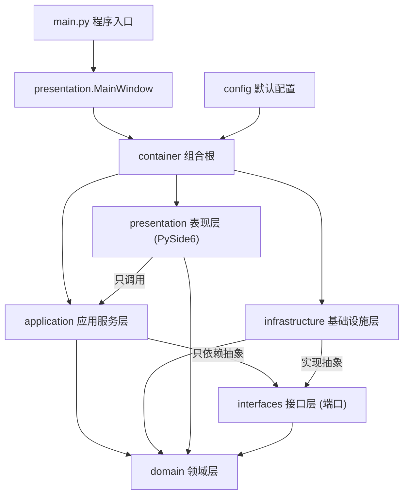

# 架构说明（ARCHITECTURE）

Feature Name: question-paper-generator
Updated: 2026-10-03

本文描述项目框架的分层结构与各模块职责。需求依据见
`.monkeycode/specs/question-paper-generator/requirements.md`，
技术设计见 `.monkeycode/specs/question-paper-generator/design.md`。

## 1. 分层总览

系统采用四层架构 + 接口层（端口）+ 组合根，依赖方向自上而下、
由抽象指向实现（依赖倒置）：



依赖规则（强制约束，违反即架构破坏）：

| 层 | 允许依赖 | 禁止依赖 |
|----|----------|----------|
| domain | 标准库 | 其他一切层 |
| interfaces | domain | application / infrastructure / presentation |
| application | domain、interfaces | infrastructure / presentation 具体实现 |
| infrastructure | domain、interfaces、config | application / presentation |
| presentation | domain、application、container | infrastructure 具体实现、sqlite3、requests |
| container | 全部（唯一知晓具体实现的位置） | — |

## 2. 目录结构

```text
workspace/
├── main.py                        程序入口：装配容器 -> 建表 -> 启动 GUI
├── requirements.txt               运行与测试依赖
├── docs/                          架构 / 依赖 / 接口文档（本目录）
├── app/
│   ├── container.py               组合根：装配完整对象图
│   ├── config/settings.py         默认配置常量（权重 / 冷却 / AI）
│   ├── domain/                    领域层（零外部依赖）
│   │   ├── enums.py               题型 / 难度 / 来源等枚举
│   │   ├── errors.py              领域异常体系
│   │   ├── entities/              Question / UsageRecord / Criteria / Paper / 配置值对象
│   │   └── validators/            题型规则校验 / 分值校验
│   ├── interfaces/                抽象接口（端口）
│   │   ├── repositories.py        题目 / 使用记录 / 任务仓储 + 配置存储
│   │   ├── ai_client.py           AI API 客户端
│   │   └── exporters.py           试卷导出器
│   ├── application/               应用服务层（用例编排）
│   │   ├── question_service.py    题库 CRUD / 批量粘贴 / 检索统计
│   │   ├── difficulty_service.py  AI 难度分析
│   │   ├── cooldown_policy.py     冷却窗口策略
│   │   ├── selection_scorer.py    选题评分决策（核心算法）
│   │   ├── weighted_sampler.py    加权随机抽样
│   │   ├── question_generator.py  AI 补题
│   │   ├── paper_composer.py      组卷总编排（核心流程）
│   │   ├── score_calculator.py    分值 / 总分计算
│   │   ├── paper_exporter.py      导出分发
│   │   └── task_history_service.py 组卷历史与配置复用
│   ├── infrastructure/            基础设施层（接口的具体实现）
│   │   ├── database/              SQLite 连接与建表
│   │   ├── repositories/          三个仓储的 SQLite 实现
│   │   ├── ai/                    OpenAI 兼容 AI 客户端
│   │   ├── exporters/             TXT / PDF 导出器
│   │   └── config_store.py        配置持久化实现
│   └── presentation/              表现层（PySide6）
│       ├── main_window.py         主窗口（菜单 / 状态栏 / 三标签页 / 信号协调）
│       ├── ui_utils.py            共享工具（枚举标签 / 对话框 / 受限调用包装）
│       └── views/                 题库 / 组卷 / 历史与设置视图
└── tests/                         测试骨架（冒烟已启用，专项用例待业务实现）
```

## 3. 核心流程与组件协作

### 3.1 题目入库链（R1-R5）

```text
QuestionBankView -> QuestionService.create_question
    -> QuestionValidator.validate          题型规则校验（R3）
    -> QuestionRepository.save             落库并分配 id
    -> DifficultyService.analyze_silent    AI 难度分析，失败置 PENDING（R4）
```

### 3.2 组卷链（R7-R10、R13）

```text
PaperGenerationView -> PaperComposer.generate
    -> _validate_criteria                  条件校验（至少一个部分启用，R7）
    -> QuestionRepository.search           命中题候选集合
    -> SelectionScorer.score               评分决策（难度匹配 / 知识点覆盖 / 质量 / 频次 / 近期）
        -> CooldownPolicy                  冷却窗口惩罚（R13）
    -> WeightedSampler.sample              加权随机抽样、同卷去重（R9）
    -> [候选不足] QuestionGenerator.generate_questions   AI API 补题（R10）
    -> UsageRepository.record_usage        使用记录更新（R13）
    -> ScoreCalculator.total_score         分值与总分汇总（R11）
    -> TaskHistoryService.save_task        任务记录（R14）
```

### 3.3 导出链（R11 / R12 / R18）

```text
PaperGenerationView -> PaperExporter.export
    -> ScoreValidator.validate             分值完整性校验（缺分值阻止导出）
    -> TxtExporter / PdfExporter           按格式渲染（两部分 / 分区小计 / 总分 / 答案页）
```

## 4. 关键设计决策

1. **端口-适配器结构**：`interfaces` 层承载全部抽象，`application` 只依赖抽象，
   替换 AI 服务、数据库引擎或导出实现时无需改动业务编排。
2. **评分决策与随机分离**：`SelectionScorer`（纯计算）与 `WeightedSampler`
   （纯算法）各自独立可测；评分因子权重、冷却窗口均由 `ScoringConfig` 配置。
3. **近期重复抑制**：使用记录（UsageRepository）+ 冷却窗口（CooldownPolicy）
   双重机制，窗口内题量不足时逐级放宽（R13 第 3 条）。
4. **AI 全部走抽象 + 降级**：`AIClient.is_configured()` 决定降级路径；
   难度分析失败置 PENDING，补题失败重试后上报实际数量（R4 / R10 / R15）。
5. **组合根唯一装配点**：`container.build_container()` 是唯一构造具体实现的
   位置，测试可用临时库构建完整对象图（见 tests/test_smoke.py）。

## 5. 框架完成度说明

本仓库当前状态为**表现层完成、业务待实现**：

- **表现层已完成**：主窗口（菜单 / 状态栏 / 三标签页 / 跨视图信号协调）、
  题库管理 / 组卷 / 历史与设置三个视图，以及共享工具 `ui_utils.py`
  （枚举中文标签、统一对话框、`run_guarded` 受限调用包装）。界面按需求
  R1-R15 提供了完整的表单、列表、实时命中量、分值编辑与导出入口。
- **业务方法为 TODO**：`application` 与 `infrastructure` 中的业务方法以
  `raise NotImplementedError("TODO(需求编号)")` 标注，TODO 括号内为对应需求
  编号（如 `TODO(R8)`），实现时可全库检索 `TODO(` 定位。
- **界面不崩溃**：视图统一经 `ui_utils.run_guarded` 调用服务；框架阶段会捕获
  未实现异常并提示，因此当前即可启动演示。仅基础设施中的连接管理、建表迁移、
  配置键值读写属于框架管道代码，已实现。
