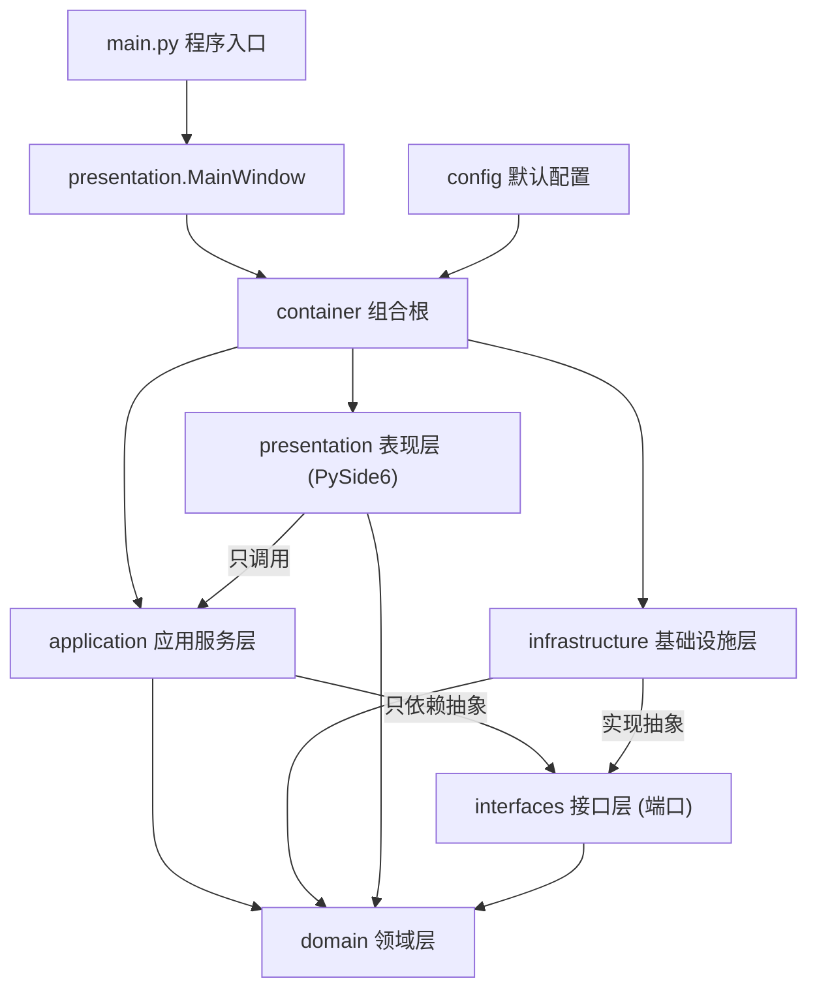

# 架构说明（ARCHITECTURE）

Feature Name: question-paper-generator
Updated: 2026-10-03

本文描述项目框架的分层结构与各模块职责。需求依据见
`.monkeycode/specs/question-paper-generator/requirements.md`，
技术设计见 `.monkeycode/specs/question-paper-generator/design.md`。

## 1. 分层总览

系统采用四层架构 + 接口层（端口）+ 组合根，依赖方向自上而下、
由抽象指向实现（依赖倒置）：



依赖规则（强制约束，违反即架构破坏）：

| 层 | 允许依赖 | 禁止依赖 |
|----|----------|----------|
| domain | 标准库 | 其他一切层 |
| interfaces | domain | application / infrastructure / presentation |
| application | domain、interfaces | infrastructure / presentation 具体实现 |
| infrastructure | domain、interfaces、config | application / presentation |
| presentation | domain、application、container | infrastructure 具体实现、sqlite3、requests |
| container | 全部（唯一知晓具体实现的位置） | — |

## 2. 目录结构

```text
workspace/
├── main.py                        程序入口：装配容器 -> 建表 -> 启动 GUI
├── requirements.txt               运行与测试依赖
├── docs/                          架构 / 依赖 / 接口文档（本目录）
├── app/
│   ├── container.py               组合根：装配完整对象图
│   ├── config/settings.py         默认配置常量（权重 / 冷却 / AI / 科目 / 提示词）
│   ├── domain/                    领域层（零外部依赖）
│   │   ├── enums.py               题型 / 难度 / 来源 / 题库操作类型等枚举
│   │   ├── errors.py              领域异常体系
│   │   ├── entities/              Question / UsageRecord / Criteria / Paper / 操作台账 / 配置值对象
│   │   └── validators/            题型规则校验 / 分值校验
│   ├── interfaces/                抽象接口（端口）
│   │   ├── repositories.py        题目 / 使用记录 / 任务 / 操作台账仓储 + 配置存储
│   │   ├── ai_client.py           AI API 客户端
│   │   └── exporters.py           试卷导出器
│   ├── application/               应用服务层（用例编排）
│   │   ├── question_service.py    题库 CRUD / 批量粘贴 / 检索统计 / AI 辨识
│   │   ├── question_history_service.py 题库操作台账：导入历史 / 编辑历史
│   │   ├── prompt_utils.py        用户可编辑提示词的安全填充
│   │   ├── difficulty_service.py  AI 难度分析
│   │   ├── cooldown_policy.py     冷却窗口策略
│   │   ├── selection_scorer.py    选题评分决策（核心算法）
│   │   ├── weighted_sampler.py    加权随机抽样
│   │   ├── question_generator.py  AI 补题
│   │   ├── paper_composer.py      组卷总编排（核心流程）
│   │   ├── score_calculator.py    分值 / 总分计算
│   │   ├── paper_exporter.py      导出分发
│   │   └── task_history_service.py 组卷历史与配置复用
│   ├── infrastructure/            基础设施层（接口的具体实现）
│   │   ├── database/              SQLite 连接与建表 / 补列迁移
│   │   ├── repositories/          题目 / 使用记录 / 任务 / 操作台账的 SQLite 实现
│   │   ├── ai/                    OpenAI 兼容 AI 客户端（urllib 实现，含重试与降级）
│   │   ├── image_store.py         题目图片本地存储（复制 + 相对路径解析）
│   │   ├── exporters/             MD / PDF 导出器（PDF 由 MD 转换）
│   │   └── config_store.py        配置持久化实现（AI / 评分 / 提示词 / 科目）
│   └── presentation/              表现层（PySide6）
│       ├── main_window.py         主窗口（菜单 / 状态栏 / 四标签页 / 信号协调）
│       ├── ui_utils.py            共享工具（枚举标签 / 对话框 / 受限调用包装）
│       └── views/                 题库 / 组卷 / 历史 / 设置四个视图
└── tests/                         测试（冒烟 / 校验器 / 题目服务 / 配置 / 表现层离屏）
```

## 3. 核心流程与组件协作

### 3.1 题目入库链（R1-R5）

```text
QuestionBankView -> QuestionService.create_question
    -> QuestionValidator.validate          题型规则校验（R3）
    -> QuestionRepository.save             落库并分配 id
    -> DifficultyService.analyze_silent    AI 难度分析，失败置 PENDING（R4）
```

### 3.2 组卷链（R7-R10、R13）

```text
PaperGenerationView -> PaperComposer.generate
    -> _validate_criteria                  条件校验（至少一个部分启用，R7）
    -> QuestionRepository.search           命中题候选集合（含指定知识点过滤，用户需求）
    -> SelectionScorer.score               评分决策（难度匹配 / 知识点覆盖 / 质量 / 频次 / 近期）
        -> CooldownPolicy                  冷却窗口惩罚（R13）
    -> WeightedSampler.sample              加权随机抽样、同卷去重（R9）
    -> [候选不足] QuestionGenerator.generate_questions   AI API 补题（R10，需用户确认）
    -> UsageRepository.record_usage        使用记录更新（R13）
    -> ScoreCalculator.total_score         分值与总分汇总（R11）
    -> TaskHistoryService.save_task        任务记录（R14）
```

### 3.3 导出链（R11 / R12 / R18）

```text
PaperGenerationView -> PaperExporter.export          （在后台线程执行，progress 回主线程显示）
    -> ScoreValidator.validate             分值完整性校验（缺分值阻止导出）
    -> MdExporter / PdfExporter            按格式渲染（两部分 / 分区小计 / 总分 / 答案页）；
                                          答案页前插入分页标记（.pagebreak）；
                                          PDF：MD -> 带 MathJax 与打印 CSS 的 HTML ->
                                          Edge 无头打印（中文由 CSS 字体指定，避免乱码）
```

### 3.4 AI 辨识链（用户需求：模块化输出、按需给出、一次返回）

```text
QuestionBankView（勾选辨识模块）
    -> [弹窗确认]                          所有 AI 调用均需用户手动确认
    -> QuestionService.recognize_draft_report(stem, options, include_solution,
                                              confirmed=True, modules=[...])
        -> _render_module_prompts          只拼装被勾选模块的输出提示词
            -> ConfigStore.load_prompt_config  PromptConfig.module_prompts（用户可逐模块改）
        -> recognize_schema(modules)        期望结构只含被勾选模块
        -> AIClient.complete(prompt, schema)  一次调用返回全部所需字段
        -> _normalize_recognition(...)      返回 RecognitionReport(fields, issues)
             · 无法识别的取值不写入 fields（不静默套默认值）
             · 缺字段 / 无法识别 / 科目不在列表 -> issues
    -> _apply_recognition                  按模块回填表单（未勾选字段不覆盖）；结果仅供参考
    -> [弹窗：AI 返回内容有问题]             issues 非空时列出清单（用户需求）

保存 / 批量导入前：
    -> QuestionService.module_states(draft)        逐项检查各模块填写状态
    -> [弹窗：AI 填充缺失项 / 手动补齐（跳过 AI）/ 取消]
        · 批量粘贴在「解析预览」时先检查一次，确认提交只作兜底
    -> recognize_draft_report(..., modules=缺失模块)  只请求缺失的模块，一次调用
    -> QuestionService.apply_recognition(draft, fields)   批量导入场景写回候选题
    -> [弹窗：AI 返回内容有问题]                    按题汇总问题清单
```

## 4. 关键设计决策

1. **端口-适配器结构**：`interfaces` 层承载全部抽象，`application` 只依赖抽象，
   替换 AI 服务、数据库引擎或导出实现时无需改动业务编排。
2. **评分决策与随机分离**：`SelectionScorer`（纯计算）与 `WeightedSampler`
   （纯算法）各自独立可测；评分因子权重、冷却窗口均由 `ScoringConfig` 配置。
3. **近期重复抑制**：使用记录（UsageRepository）+ 冷却窗口（CooldownPolicy）
   双重机制，窗口内题量不足时逐级放宽（R13 第 3 条）。
4. **AI 全部走抽象 + 降级**：`AIClient.is_configured()` 决定降级路径；
   难度分析失败置 PENDING，补题失败重试后上报实际数量（R4 / R10 / R15）。
5. **组合根唯一装配点**：`container.build_container()` 是唯一构造具体实现的
   位置，测试可用临时库构建完整对象图（见 tests/test_smoke.py）。
6. **AI 提示词模块化 + 一次调用**：辨识的每个字段（科目 / 知识点 / 题型 / 难度 /
   质量标记 / 答案 / 解析）是一个可勾选模块，各自持有一段可编辑的输出提示词；
   服务层只拼装被勾选模块的提示词与期望结构，用一次调用返回全部所需字段，
   未勾选的字段既不生成也不覆盖（用户需求：按需给出、一次返回）。
7. **AI 使用全部需用户确认 + 逐项检查**：所有 AI 入口默认拒绝（`confirmed=False` /
   `analyze_difficulty=False` / `allow_ai*=False`）；保存与批量导入前用
   `module_states()` 逐项检查填写情况并弹窗询问是否 AI 填充，题干与选项始终由出题者填写。
8. **AI 返回内容必被解释**：辨识统一走 `recognize_draft_report`，缺字段 / 取值无法识别 /
   科目不在列表都会进入 `issues` 并弹窗；无法识别的取值不写回表单，避免把"识别失败"
   悄悄变成合法默认值（用户需求：AI 返回信息有问题要有弹窗提示）。
9. **难度提示词单一来源**：`PromptConfig` 只有 `module_prompts["difficulty"]` 一处难度
   提示词，AI 辨识与难度分析（`DIFFICULTY_ANALYSIS_FRAME` 框架）共用，设置界面不再出现
   第二个难度提示词编辑框（用户需求：提示词中难度不要重复）。

## 5. 当前状态

全部核心链路已实现：

- **题库**：手工录入 / 批量粘贴 / 检索统计 / 图片导入 / AI 辨识 / 批量维护
- **标注**：AI 难度分析（远程 API 与本地模型双通道）；difficulty_source 区分 ai / manual，人工难度不被覆盖
- **组卷**：评分决策（难度 / 知识点 / 质量 / 频次 / 近期五因子）+ 加权随机抽样 + 冷却窗口 + 全卷去重；候选不足时 AI 补题
- **导出**：MD → HTML → Edge 无头打印 PDF；含图题即时渲染 Typst 图为 PNG；相邻含图题自动合并；答案页前分页
- **历史**：组卷历史 / 导入历史 / 编辑历史（操作台账）
- **AI 调用**：全部需用户手动确认；模块化一次返回；返回内容有问题时弹窗列清单；未勾选的字段既不生成也不覆盖
- **界面**：视图统一经 ui_utils.run_guarded / safe_call 调用服务，异常给出可读提示
