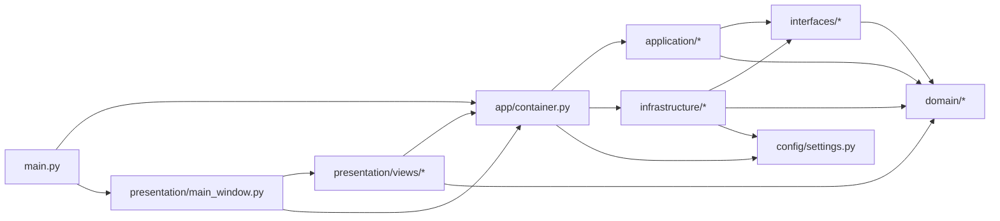

# 依赖关系文档（DEPENDENCIES）

Feature Name: question-paper-generator
Updated: 2026-10-03

本文回答两个问题：**哪个文件依赖哪一个**、**谁调用了谁**。
接口的方法级契约见 `INTERFACES.md`。

## 1. 模块级依赖图



阅读规则：箭头 A --> B 表示 A 导入并使用 B；
`interfaces` 是 `application` 与 `infrastructure` 之间的唯一桥梁。

## 2. 文件级依赖明细

### 2.1 入口与装配

| 文件 | 依赖（导入） | 被谁使用 |
|------|--------------|----------|
| `main.py` | `app.container.build_container`、`app.infrastructure.database.schema.ensure_schema`、`app.presentation.main_window.MainWindow` | 命令行启动 |
| `app/container.py` | `app.config.settings`、`app.domain.*`（枚举 / 校验器 / 配置实体）、`app.application.*`（全部服务）、`app.infrastructure.*`（全部实现）、`app.interfaces.*`（接口类型注解） | `main.py`、`app.presentation.main_window`、`tests/test_smoke.py` |
| `app/config/settings.py` | `app.domain.entities.configs`（AIConfig / ScoringConfig） | `app/container.py`、`app/infrastructure/config_store.py` |

### 2.2 领域层（domain，零外部层依赖）

| 文件 | 依赖 | 被谁使用 |
|------|------|----------|
| `app/domain/enums.py` | 无（标准库 enum） | 全部层 |
| `app/domain/errors.py` | 无（标准库） | `domain/validators`、`application/*`、`infrastructure/*`、`presentation/*` |
| `app/domain/entities/question.py` | `domain/enums` | `domain/validators`、`interfaces/repositories`、`application/question_service`、`application/selection_scorer`、`application/paper_composer`、`application/question_generator`、`infrastructure/repositories/*` |
| `app/domain/entities/usage_record.py` | 无 | `interfaces/repositories`、`application/cooldown_policy`、`application/selection_scorer`、`infrastructure/repositories/usage_repository` |
| `app/domain/entities/criteria.py` | `domain/enums` | `domain/entities/paper`、`domain/entities/task`、`application/paper_composer`、`application/task_history_service` |
| `app/domain/entities/paper.py` | `domain/entities/criteria`、`domain/entities/question`、`domain/enums` | `application/paper_composer`、`application/score_calculator`、`application/paper_exporter`、`interfaces/exporters`、`infrastructure/exporters/*` |
| `app/domain/entities/scoring.py` | `domain/entities/question`、`domain/enums` | `application/selection_scorer`、`application/weighted_sampler` |
| `app/domain/entities/configs.py` | `domain/enums` | `config/settings`、`interfaces/repositories`（ConfigStore）、`interfaces/exporters`、`application/*`（策略组件）、`infrastructure/ai/ai_client`、`infrastructure/config_store` |
| `app/domain/entities/task.py` | `domain/entities/criteria`、`domain/enums` | `application/task_history_service`、`interfaces/repositories`（TaskRepository）、`infrastructure/repositories/task_repository` |
| `app/domain/validators/question_validator.py` | `domain/entities/question`、`domain/enums`、`domain/errors` | `application/question_service`、`application/question_generator`、`app/container.py` |
| `app/domain/validators/score_validator.py` | `domain/entities/paper`、`domain/errors` | `application/paper_exporter`、`app/container.py` |

### 2.3 接口层（interfaces，端口）

| 文件 | 依赖 | 被谁使用（调用方） | 被谁实现 |
|------|------|--------------------|----------|
| `app/interfaces/repositories.py` | `domain/entities/{configs,question,question_op,task,usage_record}` | `application/question_service`、`application/question_history_service`、`application/selection_scorer`、`application/paper_composer`、`application/task_history_service`、`app/container.py`（类型注解） | `infrastructure/repositories/*`、`infrastructure/config_store.py` |
| `app/interfaces/ai_client.py` | 无 | `application/difficulty_service`、`application/question_generator`、`app/container.py` | `infrastructure/ai/ai_client.py` |
| `app/interfaces/exporters.py` | `domain/entities/{configs,paper}` | `application/paper_exporter`、`app/container.py` | `infrastructure/exporters/{txt,pdf}_exporter.py` |

### 2.4 应用服务层（application）

| 文件 | 依赖（接口 / 领域 / 内部协作） | 被谁使用 |
|------|--------------------------------|----------|
| `application/question_service.py` | `interfaces/repositories.{QuestionRepository,QuestionOpRepository,ConfigStore}`、`interfaces/ai_client.AIClient`、`domain/validators/question_validator`、`application/{difficulty_service,prompt_utils}`、`config/settings` | `presentation/views/question_bank_view`、`app/container.py` |
| `application/difficulty_service.py` | `interfaces/ai_client.AIClient`、`interfaces/repositories.ConfigStore`（提示词）、`application/prompt_utils` | `application/question_service`、`app/container.py` |
| `application/question_history_service.py` | `interfaces/repositories.QuestionOpRepository`、`domain/entities/question_op`、`domain/enums` | `presentation/views/history_view`、`app/container.py` |
| `application/prompt_utils.py` | `domain/entities/configs.PromptConfig`、`config/settings`（默认模板） | `application/{difficulty_service,question_service}` |
| `application/cooldown_policy.py` | `domain/entities/configs.ScoringConfig`、`domain/entities/usage_record` | `application/selection_scorer`、`app/container.py` |
| `application/selection_scorer.py` | `interfaces/repositories.UsageRepository`、`application/cooldown_policy`、`domain/entities/{configs,scoring}` | `application/paper_composer`、`app/container.py` |
| `application/weighted_sampler.py` | `domain/entities/scoring.ScoredQuestion` | `application/paper_composer`、`app/container.py` |
| `application/question_generator.py` | `interfaces/ai_client.AIClient`、`interfaces/repositories.QuestionRepository`、`domain/validators/question_validator` | `application/paper_composer`、`app/container.py` |
| `application/paper_composer.py` | `interfaces/repositories.{QuestionRepository,UsageRepository}`、`application/{selection_scorer,weighted_sampler,question_generator,score_calculator}`、`domain/entities/{configs,criteria,paper}`、`domain/errors` | `presentation/views/paper_generation_view`、`app/container.py` |
| `application/score_calculator.py` | `domain/entities/paper` | `application/paper_composer`、`presentation/views/paper_generation_view` |
| `application/paper_exporter.py` | `interfaces/exporters.BaseExporter`（格式映射注入）、`domain/validators/score_validator`、`domain/entities/{configs,paper}` | `presentation/views/paper_generation_view`、`app/container.py` |
| `application/task_history_service.py` | `interfaces/repositories.TaskRepository` | `presentation/views/history_view`、`app/container.py` |

### 2.5 基础设施层（infrastructure，实现方）

| 文件 | 依赖 | 实现的接口 | 被谁使用 |
|------|------|------------|----------|
| `infrastructure/database/connection.py` | 标准库 sqlite3 / contextlib | — | `infrastructure/repositories/*`、`infrastructure/config_store.py`、`app/container.py` |
| `infrastructure/database/schema.py` | `infrastructure/database/connection`（连接类型） | — | `main.py`（启动建表）、`app/container.py` |
| `infrastructure/repositories/question_repository.py` | `database/connection`、`database/schema`（questions 表）、`domain/entities/question` | `interfaces/repositories.QuestionRepository` | `app/container.py` |
| `infrastructure/repositories/usage_repository.py` | `database/connection`、`database/schema`（question_usage 表）、`domain/entities/usage_record` | `interfaces/repositories.UsageRepository` | `app/container.py` |
| `infrastructure/repositories/task_repository.py` | `database/connection`、`database/schema`（generation_tasks 等表）、`domain/entities/task` | `interfaces/repositories.TaskRepository` | `app/container.py` |
| `infrastructure/ai/ai_client.py` | 标准库 `urllib`/`json`/`socket`、`domain/entities/configs.AIConfig`、`domain/errors` | `interfaces/ai_client.AIClient` | `app/container.py` |
| `infrastructure/exporters/txt_exporter.py` | 标准库 pathlib、`domain/entities/{configs,paper}`、`domain/errors` | `interfaces/exporters.BaseExporter` | `app/container.py`（注册）、`infrastructure/exporters/pdf_exporter.py`（目录校验复用） |
| `infrastructure/exporters/pdf_exporter.py` | `reportlab`（方法内惰性导入）、`txt_exporter`（目录校验） | `interfaces/exporters.BaseExporter` | `app/container.py`（注册） |
| `infrastructure/config_store.py` | `database/connection`、`database/schema`（settings 表）、`domain/entities/configs`、`config/settings`（默认值回退） | `interfaces/repositories.ConfigStore` | `app/container.py`、`presentation/views/settings_view` |
| `infrastructure/image_store.py` | 标准库 `shutil`/`uuid`/`pathlib`、`domain/errors` | —（容器直接持有具体实现） | `app/container.py`、`presentation/views/question_bank_view` |
| `infrastructure/repositories/question_op_repository.py` | `database/connection`、`database/schema`（question_operations 表）、`domain/entities/question_op`、`domain/enums` | `interfaces/repositories.QuestionOpRepository` | `app/container.py`（装配给 QuestionService / QuestionHistoryService） |

### 2.6 表现层（presentation）

| 文件 | 依赖 | 被谁使用 |
|------|------|----------|
| `presentation/main_window.py` | `PySide6.QtGui`/`QtWidgets`、`app/container.Container`、`presentation/views/*`、`presentation/ui_utils`、`domain/entities/criteria`（复用信号载荷） | `main.py` |
| `presentation/ui_utils.py` | `PySide6.QtCore`/`QtWidgets`、`domain/enums`（标签映射）、`domain/errors`（异常分类） | `presentation/main_window.py`、`presentation/views/*` |
| `presentation/views/question_bank_view.py` | `PySide6.QtCore`/`QtGui`/`QtWidgets`、`presentation/ui_utils`、`application/question_service`（模块定义 / 逐项检查 / 按需辨识）、`domain/entities/question`、`domain/enums`、`app/container.Container`（取 QuestionService、UsageRepository、image_store） | `presentation/main_window.py`（发出 `questions_changed`） |
| `presentation/views/paper_generation_view.py` | `PySide6.QtCore`/`QtWidgets`、`presentation/ui_utils`、`domain/entities/{criteria,paper,question,configs}`、`domain/enums`、`app/container.Container`（取 PaperComposer / ScoreCalculator / PaperExporter / QuestionService） | `presentation/main_window.py`（被 F5 与信号驱动刷新，含知识点候选重建） |
| `presentation/views/history_view.py` | `PySide6.QtCore`/`QtWidgets`、`presentation/ui_utils`、`domain/entities/{criteria,task}`、`app/container.Container`（取 TaskHistoryService / QuestionHistoryService） | `presentation/main_window.py`（发出 `reuse_criteria_requested`） |
| `presentation/views/settings_view.py` | `PySide6.QtCore`/`QtWidgets`、`presentation/ui_utils`、`domain/entities/configs`、`domain/enums`、`config/settings`（默认科目与提示词）、`app/container.Container`（取 ConfigStore） | `presentation/main_window.py`（发出 `config_changed`） |

表现层内部信号（跨视图协调，由主窗口连接）：

```text
QuestionBankView.questions_changed      -> PaperGenerationView.refresh_hit_counts
                                        -> HistoryView.reload_question_history
SettingsView.config_changed             -> MainWindow 刷新 AI 状态 + 科目下拉框
HistoryView.reuse_criteria_requested(criteria)
                                        -> MainWindow 回填 PaperGenerationView 并切页
```

## 3. 第三方依赖

| 包 | 版本 | 使用位置 | 用途 |
|----|------|----------|------|
| PySide6 | >=6.6 | `presentation/*`、`main.py` | 桌面 GUI |
| reportlab | >=4.0 | `infrastructure/exporters/pdf_exporter.py`（惰性导入） | PDF 试卷渲染 |
| requests | >=2.31 | （可选）AI 调用已改用标准库 urllib | AI API HTTP 访问（备选） |
| pytest | >=8.0 | `tests/*` | 测试 |

## 4. 对象装配关系（container.build_container）

```text
DatabaseConnection(db_path)
 ├─ SQLiteQuestionRepository ──> QuestionRepository ─┐
 ├─ SQLiteUsageRepository ────> UsageRepository ─────┤
 ├─ SQLiteTaskRepository ─────> TaskRepository ──────┤
 ├─ SQLiteQuestionOpRepository > QuestionOpRepository┤
 └─ SQLiteConfigStore ────────> ConfigStore ─────────┘
        │ load_ai_config / load_scoring_config / load_prompt_config / load_subjects
        ▼
 ConfigStore.load_ai_config ──> OpenAICompatibleAIClient ──> AIClient
 ConfigStore ──> DifficultyService ──> QuestionService（AI 辨识 / 入库难度分析）
              ──> QuestionOpRepository ──> QuestionHistoryService（导入 / 编辑历史）
 Path(db_path).parent ──> LocalImageStore ──> QuestionBankView（图片导入与预览）
 ScoringConfig ──> CooldownPolicy ──> SelectionScorer ──> PaperComposer
                  WeightedSampler ──┘        │
                  QuestionGenerator ─────────┤
                  ScoreCalculator ───────────┤
 Container ──> MainWindow ──> 四个视图（题库 / 组卷 / 历史 / 设置，按需取服务）
```
